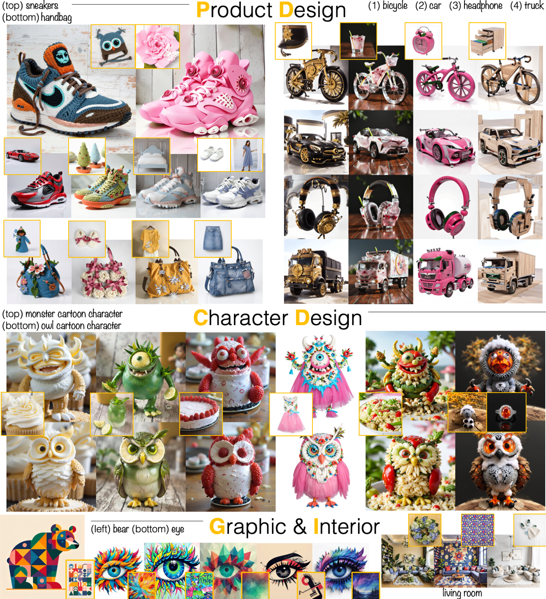
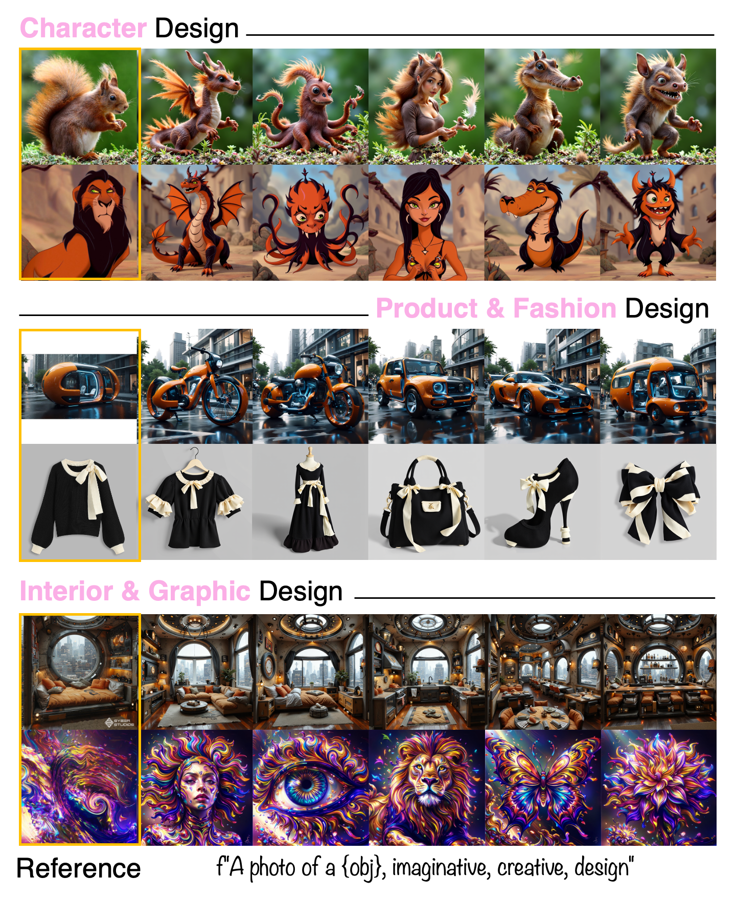

# IT-Blender



<br>

<a href="https://imagineforme.github.io/"></a> 
<a href="https://huggingface.co/Wonwoong/IT-Blender"></a>
<a href="https://huggingface.co/spaces/Yuanshi/OminiControl"></a>
<br>
<a href="https://arxiv.org/abs/2411.15098"></a>

> **Imagine for Me: Creative Conceptual Blending of Real Images and Text via Blended Attention**
> <br>
> [Wonwoong Cho<sup>1</sup>](https://wonwoongcho.github.io), 
> [Yanxia Zhang<sup>2</sup>](https://www.yanxiazhang.com/), 
> [Yan-Ying Chen<sup>2</sup>](https://www.tri.global/about-us/dr-yan-ying-chen)
> [David Inouye<sup>1</sup>](https://www.davidinouye.com/)
> <br>
> <sup>1</sup> Elmore Family School of Electrical and Computer Engineering, Purdue University
> <br>
> <sup>2</sup> Toyota Research Institute


## Key Contributions

IT-Blender is a T2I diffusion adapter that can automate the blending process of visual and textual concepts to enhance human creativity.

* **Cognitively inspired creativity-supporting AI**: IT-Blender is inspired by the *selective projection* process in human cognition, 
which compares similarities and selectively applies relevant features to blend multiple concepts. 
This can assist exploration of the design space in creative domains such as product design, character design, fashion, or advertising, 
where generating diverse, inspiring, and unconventional concepts is crucial.
* **Model-agnostic native image encoding to preserve detailed visual concepts from a reference image**:  We leverage the denoising network (both UNet-based and DiT-based) as an image encoder to maintain the details of visual concepts.
* **Superior performance in applying visual concepts in a disentangled way from the textual concept**: We design a novel *Blended Attention* that enables disentangled blending of textual semantics and detailed visual features, such as texture, material, color, and local shape.


## News
- **2025-06-12**: ⭐️ Sampling codes of [IT-Blender](https://arxiv.org/abs/2503.08280) on both SD 1.5 and FLUX have been released.

## Quick Start
### Setup
1. **Environment setup**
```bash
conda create -n itblender python=3.12
conda activate itblender
```
2. **Requirements installation**
```bash
pip install -r requirements.txt
```

### Usage example
1. **FLUX (`FLUX.1-dev`)**
```
python sample_flux.py
```
- Peak VRAM usage is 26726MiB with a single gpu.
- Options
  - ``--scale``: A scale for Blended Attention. The default value is 0.6. A value between 0.5 and 0.8 is recommended. (float, default=0.6)
  - ``--num_ref``: The number of reference images. (int, default=1)
  - ``--num_samples_per_ref`` : The number of samples to generate per a reference image. (int, default=3)
  - ``--seed`` : A random seed. (int, default=42)
  - ``--obj`` : An object to generate, e.g., monster cartoon character, dragon, sneakers, and handbag. (str, default="", which is replaced with ``["monster cartoon character", "owl cartoon character"]``)
  - ``--temperature`` : A temperature before softmax. Only used if num_ref > 1.
        Set greater than 1.0 (low temp) if the result does not clearly apply multiple reference images.
        This sharpens the softmax distribution, possibly helping to prevent ambiguous mixtures of visual concepts.
        Setting greater than 1.0 can negatively affect the generation quality. A value less than 1.5 is recommended. 
        See appendices of our paper for further details. (float, default=1.0)
  - ``--ref_preprocessing`` : Two image preprocessing algorithms are provided to deal with both square and rectangular reference images; Select either one of \"resize_centercrop\" or \"resize_addmargin\". (str, default=``resize_addmargin``)


2. **StableDiffusion (`SD 1.5`)**
```
python sample_sd15.py
```
- Peak VRAM usage is 6364 MiB with a single gpu.
- Options
  - ``--scale``: A scale for Blended Attention. The default value is 0.25. A value between 0.2 and 0.3 is recommended. (float, default=0.25)
  - ``--num_samples_per_ref`` : The number of samples to generate per a reference image. (int, default=4)
  - ``--seed`` : A random seed. (int, default=42)
  - ``--obj`` : An object to generate, e.g., monster cartoon character, dragon, sneakers, and handbag. (str, default="", which is replaced with ``"motorcycle"``)
  - ``--ref_preprocessing`` : Two image preprocessing algorithms are provided to deal with both square and rectangular reference images; Select either one of \"resize_centercrop\" or \"resize_addmargin\". (str, default=``resize_addmargin``)


## Pretrained Models

| Model                                                                                            | Base model     | Description                                                                                                                                                 | Resolution   |
| ------------------------------------------------------------------------------------------------ | -------------- | ----------------------------------------------------------------------------------------------------------------------------------------------------------- | ------------ |
| [`IT-Blender FLUX`](https://huggingface.co/Wonwoong/IT-Blender/tree/main/FLUX) | FLUX.1-dev | The model used in the paper (1.43GB).                                                                                                                               | (512, 512)   |
| [`IT-Blender StableDiffusion`](https://huggingface.co/Wonwoong/IT-Blender/tree/main/sd15)      | SD 1.5 | The model used in the paper (99.1MB).                                                                                                         | (512, 512)   |

## Feasible Design 

The blended results are more practical and feasible when the given cross-modal concepts are semantically close. More examples are provided in our project page.



## Societal Impact

- **Positive societal impact**: IT-Blender can augment human creativity, especially for people in creative industries, e.g., design and marketing. With IT-Blender, designers might be able to have better final
design outcome by exploring wide design space in the ideation stage.
- **Negative societal impact**: IT-Blender can be used to apply the design of an existing product to the new products. The user must be aware of the fact that they can infringe on the company’s intellectual property if a specific texture pattern or material combination is registered. *We encourage users to use IT-Blender to augment creativity in the ideation stage, rather than directly having a final design outcome.*

## Citation
```
@article{tan2024ominicontrol,
  title={OminiControl: Minimal and Universal Control for Diffusion Transformer},
  author={Tan, Zhenxiong and Liu, Songhua and Yang, Xingyi and Xue, Qiaochu and Wang, Xinchao},
  journal={arXiv preprint arXiv:2411.15098},
  year={2024}
}